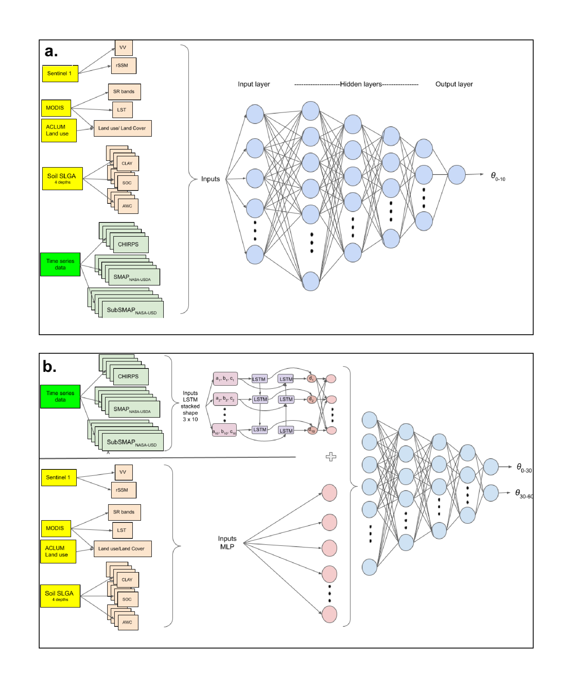
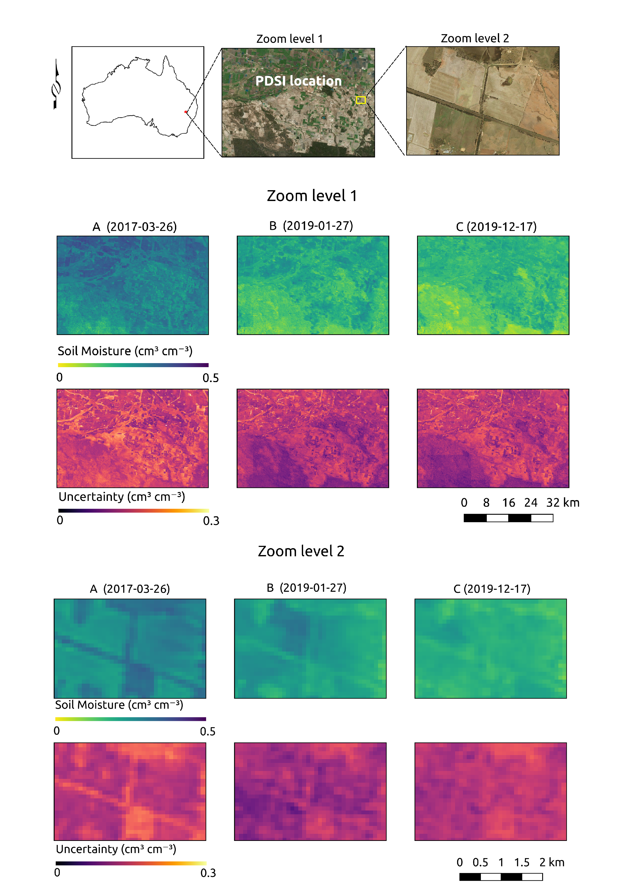

# Soil moisture JoH

Code associated with the publication entitled [Towards near real-time national-scale soil water content monitoring using data fusion as a downscaling alternative](https://www.sciencedirect.com/science/article/abs/pii/S0022169422002803) in **Journal of Hydrology** by Ignacio Fuentes, José Padarian, and R. Willem Vervoort from The University of Sydney


**doi**: https://doi.org/10.1016/j.jhydrol.2022.127705


## About

The Scripts correspond to colab notebooks which require the use of Google Earth Engine (GEE), and they allow to get inputs for the modelling approach. Additionally, they contain code for generating and training deep learning models and functions for plotting and processing the data. 

<p align="center">
  
</p>

An example of SHapley Additive exPlanations (SHAP) was also included to determine the importance of covariates and their relationship with model predictions. 

<p align="center">
  
</p>

Additionally, a python file for writing rasters was also included.

.png" "title-1") 

<p align="center">
  
</p>

## How to cite this work?

### Article

```
@article{fuentes2022spatial,
  title={Towards near real-time national-scale soil water content monitoring using data fusion as a downscaling alternative},
  author={Fuentes, Ignacio and Padarian, Jos{\'e} and Vervoort, R Willem},
  journal={Journal of Hydrology},
  pages = {127705},
  year={2022},
  publisher={Elsevier}
}
```
